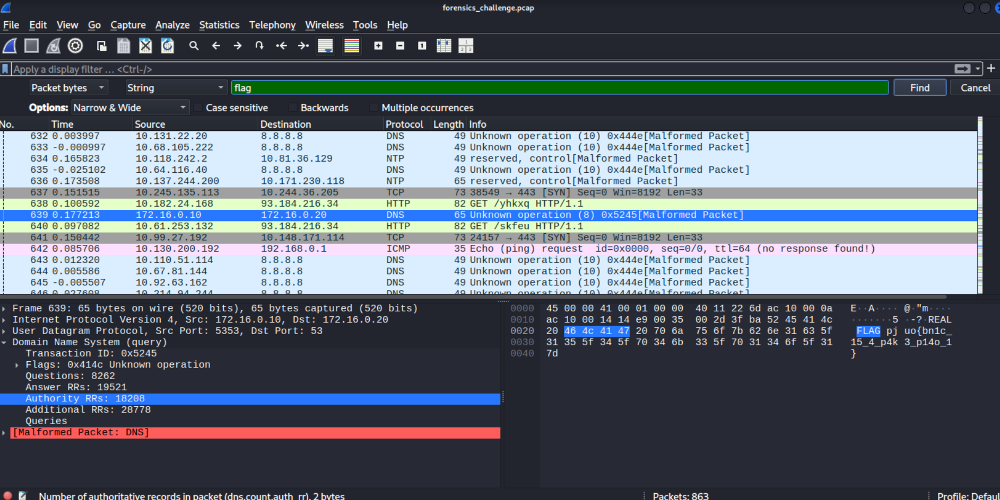

# Write Up for Challenge 1

#### Domain: Forensics
## Description:

Look out for message and get the flag.

Attachments:  ```forensics_challenge.pcap```

## Walkthrough

A ```pcap``` file is given so first of all we will look it upon in ```wireshark```.


Description says look for the message, so searching for string message, got the foloowing hint.


Hint:

```
Check for scripts and corresponding part of the script flags
```

This means there are more than one script in the pcap mostly and flag is broken into parts for different scripts.

### Next Step: Searching for scripts

After searching ```scripts``` got nothing but on searching ```script``` got 4 scripts.

Then saving those scripts as file by 
```
Follow -> TCP Stream -> Save as ASCII Text
```

Checking the scripts: 
These were some custom scripts combining 2 differnt cipher encryption method together make it complicated to solve.

### Next Step: Look for Flags

Looking for flags got some cipher text looking like base64 but are not decrypted using ```dcode```.


Upon looking for more flags, got a hint: ```Real FLAG``` written in front of some flags.



Then, after searching for ```REAL FLAG``` got this 8 strings 

```
4vf98wbxr3xe3}34}q734x}93}
973cmskx70a
xQScKC9jJEFwykJ=
pjuo{bn1c_15_4_p4k3_p14o_3}
lrs_rgn22ia
pjuo{bn1c_15_4_p4k3_p14o_1}
uxmgc{bnm5_
WjueW3q0xACwUwB1UwOcWgOoJ19jJQOkUwG9
```

Now we have 8 strings, 4 scripts, after trying all the pattern, got this

```
flag{th1s_15_4_f4k3_f14g_4}
g3_pr0b13m}
i5_4_f0r3ns
flag{th1s_15_4_f4k3_f14g_3}
ic5_ch4ll3n
flag{th1s_15_4_f4k3_f14g_1}
axios{thi5_
flag{th1s_15_4_f4k3_f14g_2}
```
After arranging pieces other than the fake flags, we got the final flag

```
axios{thi5_i5_4_f0r3nsic5_ch4ll3ng3_pr0b13m}
```