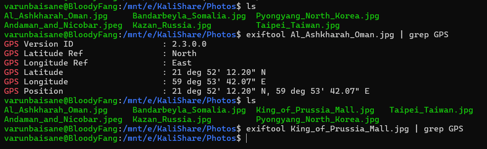

# Write Up for Challenge 2

#### Domain: OSINT
## Description:
This is some confidential info we got from Chris Morris (this is what he said about his name) an under cover of our enemies.[Who is is now our custody 😉]
They have hidden the flag which will lead us closer to the enemy base.
Try to find the base by searching for the flag 

link: https://www.protectedtext.com/dckm0398

pw: 8930mkcd

Do well!!!

## Walkthrough

First on visiting the link after prompting the password, first thing noticed is two tabs containing bunch of encrypted text.

By looking at it, it was clear it was base64. After decrypting using [dcode](https://www.dcode.fr/cipher-identifier) or [cyberchef](https://gchq.github.io/CyberChef/#recipe=From_Base64('A-Za-z0-9%2B/%3D',true,false)) tab 2 required twice decryption for getting plain text.

### For tab 1:
```
[Chris Morris] — Roger, I don’t know how much longer I can keep this up. Every day feels like I’m being watched.

[Gol D Roger] — That’s because you’ve left too many traces, Chris. Your whole life is basically mapped out on the internet. From Kazan to Oman to Taiwan, your footprints are everywhere.

[Chris Morris] — I can’t erase the past. Too many photos, too many accounts.

[Gol D Roger] — Speaking of accounts, I still can’t believe you use the same one for both personal and… “work.”

[Chris Morris] — It was convenient. And I thought I was clever by disguising it.

[Gol D Roger] — Disguising? You literally wrote it down in that notebook once. I remember it clear as day: daniel.r.4.11.4@gmail.com
.

[Chris Morris] — Don’t say it so openly. If anyone finds that, it’s over.

[Gol D Roger] — Relax. Nobody’s going to scroll through an old chat log just to find your email. It’s the password that really matters.

[Chris Morris] — You mean the one that mixes numbers and symbols?

[Gol D Roger] — Yes, the one you bragged about creating when you thought you were being “uncrackable.” What was it again… oh right: passw0rd-4or-d@niel. Very clever, replacing letters with symbols like it’s still 2005.

[Chris Morris] — I thought it would be enough. Nobody guesses something so personal.

[Gol D Roger] — Personal? Anyone who knows your son’s birthday and your alias “Daniel K” could piece that together. Security through obscurity never lasts.

[Chris Morris] — Stop calling it that. It was just a name I used once, a joke about legends.

[Gol D Roger] — Joke or not, you’ve hidden something important in those photos. You underestimate persistence. Sooner or later, someone will connect the dots — the road poneglyphs, as we called them.

[Chris Morris] — And that intersection leads to…

[Chris Morris] — If they find that image, everything collapses.

[Gol D Roger] — Exactly. And that’s why I told you, Chris — sometimes the greatest treasure isn’t gold, it’s the flag waiting to be discovered.
```

This gave a conversation between Gol D roger and Chris Morris. From conversation we get to know following things:
1. Chris Morris has went to many places globally.
2. Got email ```daniel.r.4.11.4@gmail.com``` and passowrd ```passw0rd-4or-d@niel```.
3. Chris Morris Another name is Daniel K used as alias
4. Taling about some photos which are important.
5.  They were talking about ```road poneglyphs```, after searching on the web, it is from anime fiction "One Piece", where road poneglyphs lead the path to the last island of the voyage and for that we need all the poneglyphs. So, there should be places whose intersection would lead us to the final part.


### For tab 2:

This seems to be letters addressed to someone beloved to Chris Morris. It also tells about different places he has visited.


#### Further joining the cues,

Firstly got the access to the mail whose password was given.

As they were talking about photos, upon checking google photos, there were 100s of images of different scenary.

But can't work on this much big piece of img data directly.

Searching about alias "Daniel K" , this one matches the identity the most about all the people


Checking upon locations many of these locations were talked in the tabs.

Checking those locations with image, 
we got the following six image


After checking other images and these images, we got coordinates of the places using ```exiftool```



```
Al_Ashkharah_Oman.jpg: (21.8700561, 59.8950207)

Bandabeyla_Somalia.jpg: (8.7556336, 53.7188324)

Kazan_Russia.jpg :(56.1249379, 47.6166042)

Taipei_Taiwan.jpg: (26.8639514, 123.4921004)

Andaman_and_Nicobar.jpeg: (9.4042067, 90.8242704)

Pyongyang_North_Korea.jpg (39.2199399, 126.3518508)
```

Plotting this points and taking the clue of road poneglyph and drawing lines to get the final place, this is got using ```Google Earth```


They are crossing up at lucknow.

Then checking in photos for any image of lucknow, got his one.


Upon using ```exiftool```


It says Skipped unknown 68 bytes after JPEG APP0 segmet 

Then checking the hex of the file using ```xxd```


We got some encrypted text.

```
YXhpb3N7b3MxaW50X2NoYWxsXzNuM215X2I0czNfbHVsdV9tNGxsX2x1Y2tuMHd9DQo=
```

And decrypting from base64 we finally get the flag and the enemy base.

```
axios{os1int_chall_3n3my_b4s3_lulu_m4ll_luckn0w}
```